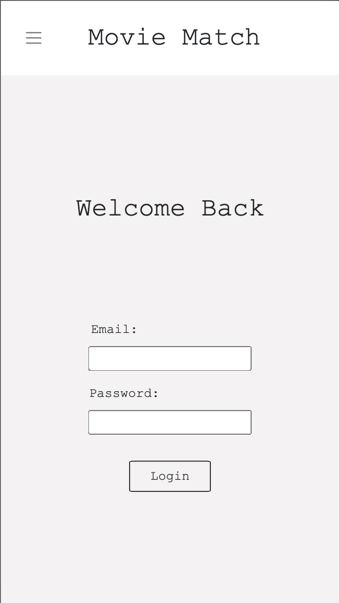

# Movie Match
An application that allows two users to sort through a list of movies (provided via moviedb api) and like or dislike each movie. Which then saves the pair(s) of matches between the two users and compiles a list of the users matches for them to view.

# Full-Stack Web Application
 * Frontend developed in React.js
 * Backend developed in Node.js utilizing express.js

# Preview

